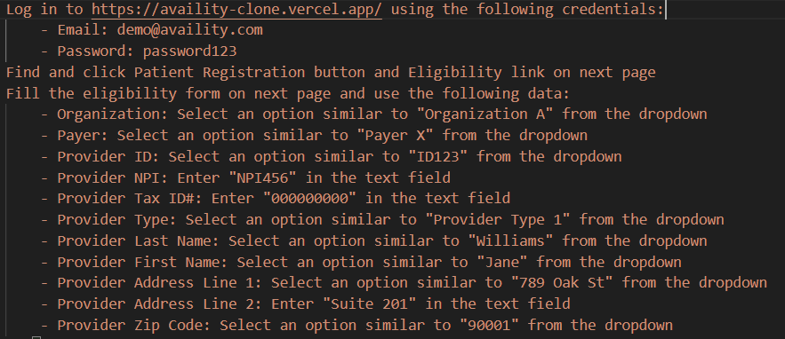
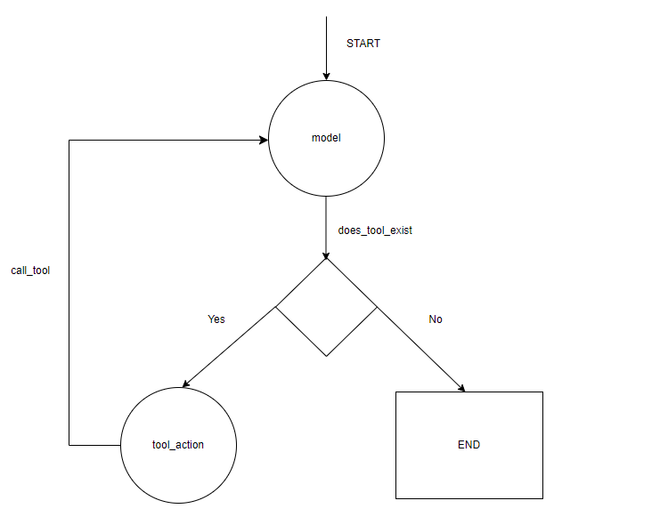

# Custom web browser automation agent using LangGraph

This project is aimed at producing a web automation browsing agent that can be fine-tuned to follow specific instructions and complete associated tasks. The model harnesses LLM model capabilities using [LangGraph](https://langchain-ai.github.io/langgraph/tutorials/introduction/)

* Installation:
    * need [GROQ API Key](https://console.groq.com/login).
    * need [AgentQL API Key](https://dev.agentql.com/sign-in?redirect_url=https%3A%2F%2Fdev.agentql.com%2F). Set it in project environment.

1. Clone repo locally
2. Install requirements
    `pip install -r requirements.txt`
3. Run main.py

* Prompt used:

* Model graph diagram:

